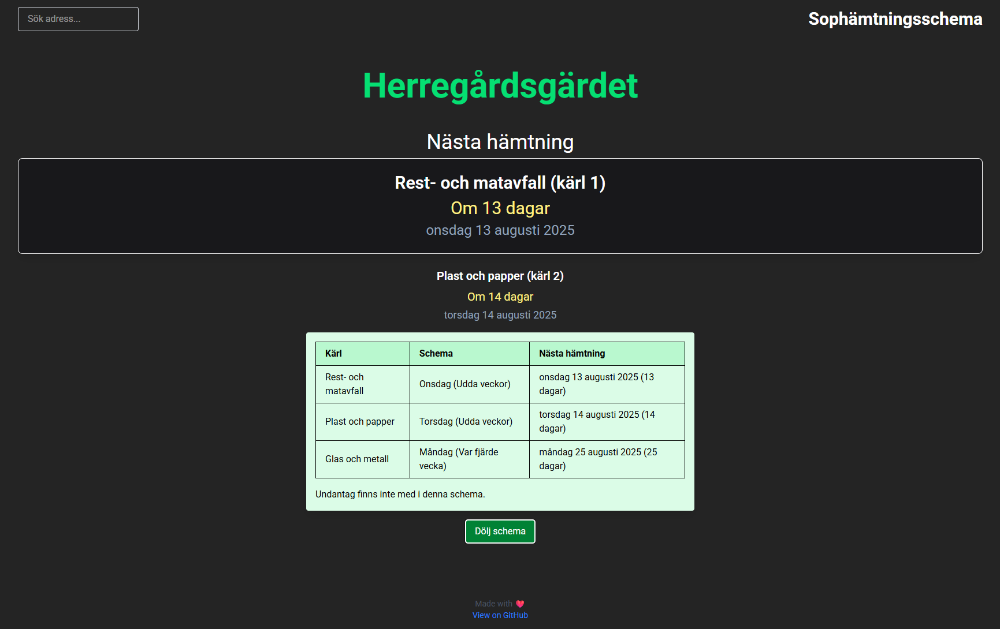

# Sophämtningsschema (Garbage Collection Schedule)


[](https://github.com/BunnyFiscuit/sophamtning/actions/workflows/pages/pages-build-deployment)

> _Name is a work in progress_

This project was started for the community I live in — Gothenburg, Sweden. Like many neighborhoods, we have specific days for when garbage bins are collected. However, since each type of waste (e.g. food, paper, plastic, metal) has its own schedule, it can get confusing fast.

This web app helps residents find out:

- Which bin to put out
- On which day it will be collected next

[https://saro.sh/sophamtning](https://saro.sh/sophamtning)



## 🗂️ Data Format

The data is currently stored in a local JSON file for simplicity. Here's an example:

```json
[
  {
    "id": 1,
    "address": "Herregårdsgärdet",
    "city": "Angered",
    "schedule": [
      {
        "bin": "Rest- och matavfall",
        "binNr": "1",
        "day": "Onsdag",
        "frequency": "odd_weeks"
      },
      {
        "bin": "Plast och papper",
        "binNr": "2",
        "day": "Torsdag",
        "frequency": "odd_weeks"
      },
      {
        "bin": "Glas och metall",
        "binNr": "3",
        "day": "Måndag",
        "frequency": "every_4th_week",
        "startWeek": 15
      }
    ]
  }
]
```

## 📍Why Only One Address?

Right now, the app only includes one address — my own — because that’s the only data I have access to. The rest of Gothenburg’s garbage collection data isn’t publicly available (yet).

When I get access to more, I’ll add it.

## 🤝 Contributing

Want to add your own street or neighborhood?

- Open a pull request with a new entry (following the structure above), or
- Describe your schedule in a PR or issue, and I’ll add it manually
- Send an email to: sarosh.nasir@gmail.com

Contributions are welcome! ❤️

## 🔓 License

This project is licensed under the [MIT License](https://raw.githubusercontent.com/BunnyFiscuit/sophamtning/refs/heads/main/LICENSE).
